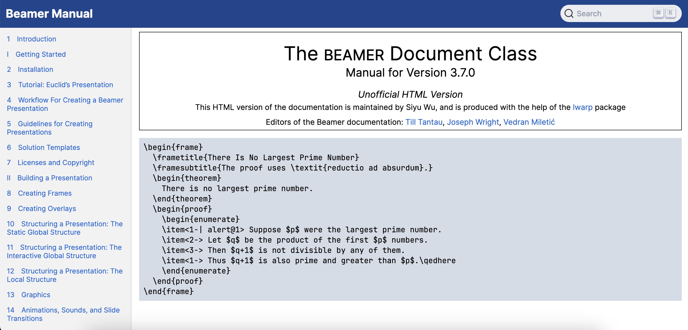

# HTML version of the Beamer documentation 

## Introduction

This is a [HTML version](https://www.beamer.plus) of the Beamer documentation.
It is produced using the incredibly powerful [`lwarp`](https://ctan.org/pkg/lwarp) package written by [Brian Dunn](https://bdtechconcepts.com)
and many Python modules, especially the BeautifulSoup module.

## Feedback

For feedback, bug reports, and feature requests, please open an issue in [beamer-html-manual issues](https://github.com/SwitWu/beamer-html-manual/issues).

## Acknowledgements

+ [`lwarp` package](https://ctan.org/pkg/lwarp)
+ [pgf-tikz-html-manual](https://github.com/DominikPeters/pgf-tikz-html-manual)
+ [BeautifulSoup](https://www.crummy.com/software/BeautifulSoup/bs4/doc/) and many other Python modules
+ pdftocairo tool
+ [Inter font family](https://rsms.me/inter/)
+ [JetBrains Mono font family](https://www.jetbrains.com/lp/mono/)
+ Algolia's [DocSearch](https://docsearch.algolia.com/docs/legacy/run-your-own)

## Sponsor

If you find this project helpful, please consider to make a donation to help the author have a better
maintainance of this project.

